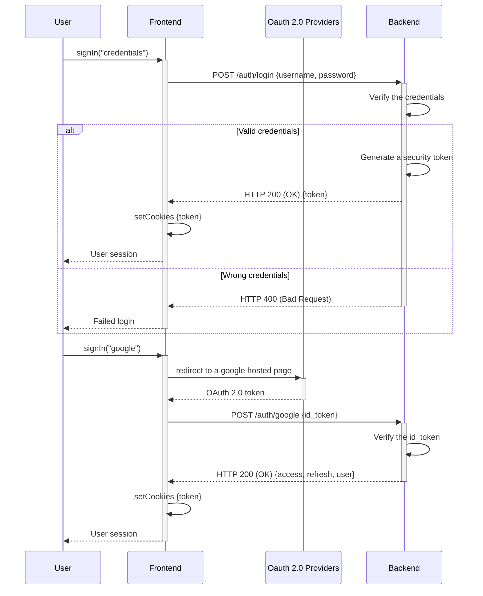

This is a [Next.js](https://nextjs.org/) project bootstrapped with [`create-next-app`](https://github.com/vercel/next.js/tree/canary/packages/create-next-app).

## Description

We used TMDB API for retrieve movies and series informations.

Db usage : postGres vercel online


## Getting Started

Install all dependencies:

```bash
npm i
# or
yarn 
```

Run the development server:

```bash
npm run dev
# or
yarn dev
# or
pnpm dev
```

Open [http://localhost:3000](http://localhost:3000) with your browser to see the result.

### Login Sequence Diagram



### SignUp Sequence Diagram

```mermaid
sequenceDiagram
    participant User
    participant Frontend
    participant Backend

    User->>+Frontend: signUp("credentials")
    Frontend->>+Backend: POST /auth/signup {username, password}
    Backend->>Backend: Verify if username exist
    alt User doesn't exist
        Backend->>Backend: Create a new user account
        Backend-->>Frontend: HTTP 201 (Created)
        Frontend-->>User: Account created successfully (redirect to login page)
    else User already exist
        Backend-->>-Frontend: HTTP 400 (Bad Request)
        Frontend-->>-User: Failed to create account, username exists in db
    end